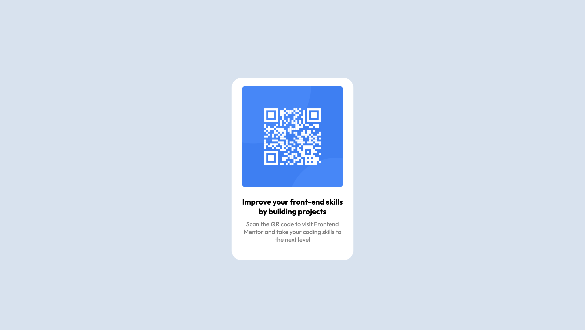

# Frontend Mentor - QR code component solution

This is a solution to the [QR code component challenge on Frontend Mentor](https://www.frontendmentor.io/challenges/qr-code-component-iux_sIO_H). Frontend Mentor challenges help you improve your coding skills by building realistic projects. 

## Table of contents

- [Overview](#overview)
  - [Screenshot](#screenshot)
  - [Links](#links)
- [My process](#my-process)
  - [Built with](#built-with)
  - [What I learned](#what-i-learned)

**Note: Delete this note and update the table of contents based on what sections you keep.**

### Overview
A project to develop a responsive qr code.

### Screenshot



### Links

- Solution URL: [(http://127.0.0.1:3000/assets/index.html)]
- Live Site URL: [Add live site URL here](https://your-live-site-url.com)

## My process
When I first began this project - I did not have a good grasp with Flexbox or Grid, so I tried using CSS without either resources and only margins. This brought too many complications, so I took a break and learned Flexbox and Grid to better approach this project. Upon learning I decided to use flexbox due to there being only one main component. I created a container div and then a smaller div to house the qr code and text. 

Using flexbox I justified and aligned the content center. I then used margins and border radius to adjust content in the divs to match the original styling. I then further styled additional components including paragraphs and headings.

Last I used media queries to create a responsive design based on different device widths.

### Built with

- Semantic HTML5 markup
- CSS custom properties
- Flexbox

### What I learned

This challenge allowed me to work more with CSS Flexbox and better hone my skills.


```html
<h1>Some HTML code I'm proud of</h1>

body {
    background-color: hsl(212, 45%, 89%);
    margin: 0;
    height:100vh;
    display:flex;
    flex-wrap: wrap;            
    align-items: center;
    justify-content: center;
}